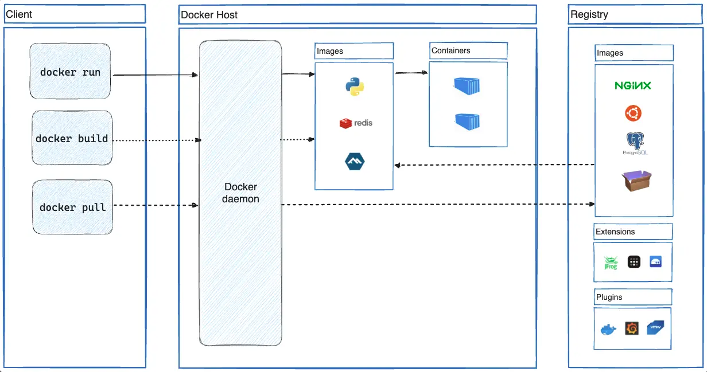

# Docker Runtime

# 官方文档

* https://docs.docker.com/get-started/
* https://docs.docker.com/manuals/
* https://docs.docker.com/reference/


Docker Hub：

* https://hub.docker.com/


# 安装

在 Maunals 页面中找到 Docker Engine 的安装文档，由于虚拟机系统使用的是 CentOS 7，因此可以参考这个：

* https://docs.docker.com/engine/install/rhel/

有些版本的 Linux 发行版系统会内置 docker 服务，如果要装新的可以先卸载默认的服务，文档里用的是 CentOS 8+ 提供的 dnf 命令去处理的，之前的版本也可以安装 dnf：

```shellscript
sudo dnf remove docker \
                  docker-client \
                  docker-client-latest \
                  docker-common \
                  docker-latest \
                  docker-latest-logrotate \
                  docker-logrotate \
                  docker-engine \
                  podman \
                  runc
```

CentOS 7 可以使用 yum，记得先停止服务，另外我们使用的是最小安装版本，默认不会安装 docker 服务：

```shellscript
sudo yum remove docker \
                  docker-client \
                  docker-client-latest \
                  docker-common \
                  docker-latest \
                  docker-latest-logrotate \
                  docker-logrotate \
                  docker-engine
```

虽然之前已经将系统 yum 仓库替换成阿里云的，但是没法获取到最新的 docker 软件，可以添加国内单独的 docker 镜像仓库：

* 阿里云镜像网站：https://developer.aliyun.com/mirror/
* 添加镜像的操作，可以参考 https://developer.aliyun.com/mirror/docker-ce


```shellscript
# 安装 yum-utils, 它是用于 yum 包管理的一系列工具
yum install -y yum-utils
yum info yum-utils

# 使用 yum-utils 提供的 yum-config-manager 工具管理仓库
man yum-config-manager
# 添加仓库
yum-config-manager --add-repo=https://mirrors.aliyun.com/docker-ce/linux/centos/docker-ce.repo
# 参考 docker 官网给出的安装命令
yum install -y docker-ce docker-ce-cli containerd.io docker-buildx-plugin docker-compose-plugin
```

先了解一下 docker 的架构，再解释上面安装的各项服务的功能：

docker 使用 client-server 架构



我们常用的 docker 命令就是 client，docker daemon 属于 server 端，用于管理 image 和运行 container，发挥着非常重要的作用；

client 和 server 通过 REST APi 或 UNIX sockets 或 network interface 进行通信，这意味着 client 既可以和本机上的 server 通信，也可以和远程 server 通信；

client 除了常规的 docker 命令外，还有一个 docker compose，它允许连接有一组 container 构成的应用程序；

docker server 中含有不少 objects，包括 images、containers、networks、volumes、plugins 等等；

存放 docker images 的地方叫做 docker registry，默认情况下使用的是公共的 Docker Hub 作为 registry，当然也可以根据需要配置私有的仓库；


再看一下上面使用 yum 安装的各个软件：

* docker-ce：由 Docker 社区开源的容器引擎，提供 dockerd 和 docker 工具（i.e. client + server），允许用户创建、运行和管理容器，是 Docker 的核心组件；
* docker-ce-cli：Docker 命令行接口工具，提供与 docker 守护进程交互的命令行工具，通过 docker 命令可以管理 container、image、network、volume 等等；
* containerd.io：遵循行业标准的容器运行时环境，Docker 在其基础上构建各项功能，实现容器的整个生命周期（创建、启动、停止、删除等等）；
* docker-buildx-plugin：Docker Buildx 是 Docker CLI 的插件，用于扩展 docker 的构建功能；
* docker-compose-plugin：Docker Compose 是一个用于定义和运行多容器 Docker 应用程序的工具，通过 docker-compose.yml 定义多个容器的配置、网络、卷等等，再使用 docker compose 命令一键启动、停止和管理多容器应用；


# 启动 Docker

前面安装了 docker 软件后，可以使用 systemctl 来管理 docker 服务：

```shellscript
# 立即启动 docker 服务并设置为允许开机自启
systemctl enable --now docker

# 查看服务状态
systemctl status docker

● docker.service - Docker Application Container Engine
   Loaded: loaded (/usr/lib/systemd/system/docker.service; enabled; vendor preset: disabled)
   Active: active (running) since 一 2025-01-20 19:14:15 CST; 6s ago
     Docs: https://docs.docker.com
 Main PID: 3963 (dockerd)
    Tasks: 10
   Memory: 31.1M
   CGroup: /system.slice/docker.service
           └─3963 /usr/bin/dockerd -H fd:// --containerd=/run/containerd/containerd.sock

1月 20 19:14:15 localhost.localdomain systemd[1]: Starting Docker Application Container Engine...
1月 20 19:14:15 localhost.localdomain dockerd[3963]: time="2025-01-20T19:14:15.269367052+08:00" level=info msg="Starting up"
1月 20 19:14:15 localhost.localdomain dockerd[3963]: time="2025-01-20T19:14:15.355832762+08:00" level=info msg="Loading containers: start."
1月 20 19:14:15 localhost.localdomain dockerd[3963]: time="2025-01-20T19:14:15.724097801+08:00" level=info msg="Firewalld: interface docker0 already part of docker zone, returning"
1月 20 19:14:15 localhost.localdomain dockerd[3963]: time="2025-01-20T19:14:15.772381247+08:00" level=info msg="Loading containers: done."
1月 20 19:14:15 localhost.localdomain dockerd[3963]: time="2025-01-20T19:14:15.788289251+08:00" level=info msg="Docker daemon" commit=de5c9cf containerd-snapshotter=false stor...sion=26.1.4
1月 20 19:14:15 localhost.localdomain dockerd[3963]: time="2025-01-20T19:14:15.788450469+08:00" level=info msg="Daemon has completed initialization"
1月 20 19:14:15 localhost.localdomain dockerd[3963]: time="2025-01-20T19:14:15.817713456+08:00" level=info msg="API listen on /run/docker.sock"
1月 20 19:14:15 localhost.localdomain systemd[1]: Started Docker Application Container Engine.
Hint: Some lines were ellipsized, use -l to show in full.
```


# Hello World

国内从 docker hub 下载镜像速度很慢，参考官方文档配置 proxy：https://docs.docker.com/reference/cli/dockerd/#proxy-configuration

三种方式：

* 系统变量中配置 HTTP_PROXY、HTTPS_PROXY 和 NO_PROXY 三个变量（毕竟是用 Go 开发的）；
* docker 的 daemon configuration file 中配置三个变量；（要求 docker engine version 23.0 +）
* 使用 --http-proxy、--https-proxy、--no-proxy 命令行参数；（要求 docker engine version 23.0 +）

命令行和 daemon 配置文件的优先级要比环境变量高。

其中 daemon.json 配置文件中完整的选项可以参考：https://docs.docker.com/reference/cli/dockerd/#daemon-configuration-file

这三种都需要有代理服务器，而且一旦配置了 docker 服务的网络都会走代理，不能按需启用，比较麻烦，配置的都是 daemon.json 中的 proxies 对象；

看大家常用的方式是配置国内的镜像源，但是有很多源都不能用了，相关配置是 daemon.json 的 registry-mirrors 数组：

列出几个，2025-01-21 测试有效：

感谢大佬收集：https://www.coderjia.cn/archives/dba3f94c-a021-468a-8ac6-e840f85867ea

```json
{
    "registry-mirrors": [
        "https://docker-0.unsee.tech",
        "https://docker-cf.registry.cyou",
        "https://docker.1panel.live"
    ]
}
```

填写相关网址后执行以下命令重启服务：

```shellscript
systemctl daemon-reload && systemctl restart docker
```

运行 docker 官方给的 hello world 示例：

```shellscript
> docker run hello-world

Unable to find image 'hello-world:latest' locally
latest: Pulling from library/hello-world
c1ec31eb5944: Pull complete 
Digest: sha256:1b7a37f2a0e26e55ba2916e0c53bfbe60d9bd43e390e31aacd25cb3581ed74e6
Status: Downloaded newer image for hello-world:latest

Hello from Docker!
This message shows that your installation appears to be working correctly.

To generate this message, Docker took the following steps:
 1. The Docker client contacted the Docker daemon.
 2. The Docker daemon pulled the "hello-world" image from the Docker Hub.
    (amd64)
 3. The Docker daemon created a new container from that image which runs the
    executable that produces the output you are currently reading.
 4. The Docker daemon streamed that output to the Docker client, which sent it
    to your terminal.

To try something more ambitious, you can run an Ubuntu container with:
 $ docker run -it ubuntu bash

Share images, automate workflows, and more with a free Docker ID:
 https://hub.docker.com/

For more examples and ideas, visit:
 https://docs.docker.com/get-started/
```

定制 proxy 和 registry-mirrors 适合云端 Linux 系统，我们本地使用的是虚拟机环境，可以改 registry-mirrors，也可以使用宿主机的代理工具，比如用 clash 的 TUN 虚拟网卡模式，代理所有流量，这样从虚拟机中执行 docker 客户端命令，流量被宿主机的 clash 网卡拦截，能正常访问 docker hub 服务。

